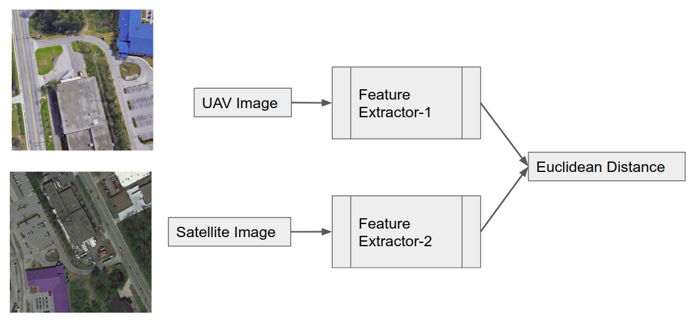

# UAV Geolocalization Using Satellite Imagery



Unmanned aerial vehicles or UAVs mostly rely on GPS data to precisely determine their global pose. However, data from GPS can sometimes be unreliable such as in case of loss of line-of-sight, presence of jammers, unfavourable weather conditions etc. In this work, we assume a GPS denied environment and match the images from UAV camera with the available satellite imagery. Such a technique can be utilized to estimate the global pose of the UAV in the absence of GPS. 

For more details:
* Read the [blog](https://abhinavtripathi95.github.io/lets-talk/technical/2020/08/03/uav-geolocalization.html)
* Download the [report](https://github.com/abhinavtripathi95/geolocalization/raw/master/assets/thesis.pdf)

## Dataset
|  &nbsp;&nbsp;  &nbsp;&nbsp; |
|:--:| 
| *3 examples of matching UAV and satellite pairs from dataset* |

As it can be seen from the above images, the UAV and satellite images 
differ considerably from each other. We train a dual network on this 
dataset to recognize whether a pair of images are from same scene or not.

## Training Strategy
* The UAV and satellite images are normalized with ImageNet stats
* Resnet18 models pretrained on ImageNet dataset are used 
* The model is divided into 3 layer groups for discriminative layer training
and gradual unfreezing
* One cycle policy with cosine annealing of learning rates is used for training

## Requirements
* Cuda enabled GPU
* `torch==1.4.0`
* `torchvision==0.5.0`
* `fastai` library (v1)
* NOTE on fastai: This code was written using fastai v1, which may soon be moved to `fastai/fastai1`. In this case, installation instructions below will not work. 

## Installation

* Using pip
```bash
$ pip install torch==1.4.0 torchvision==0.5.0
$ pip install fastai
```
* Using conda
```bash
$ conda install pytorch==1.4.0 torchvision==0.5.0 -c pytorch
$ conda install -c fastai fastai 
```
* Check version in python
```python
>>> import fastai
>>> fastai.__version__
'1.0.61'
```

## Downloads
* Download [*Aerial Cities* dataset](https://uofi.app.box.com/s/4jfvpmxwiob0hcg25z4lgd5qgnk0q8nb)
* Pre-trained Models: [DualResNet18+](https://github.com/abhinavtripathi95/geolocalization/raw/master/models/R00_allcities_export) [SiamResNet18+](https://github.com/abhinavtripathi95/geolocalization/raw/master/models/R00b_allcities_export)
* Training Notebooks: [DualResNet18+](R00_allcities_dualres.ipynb) [SiamResNet18+](R00b_allcities_siamres.ipynb)
