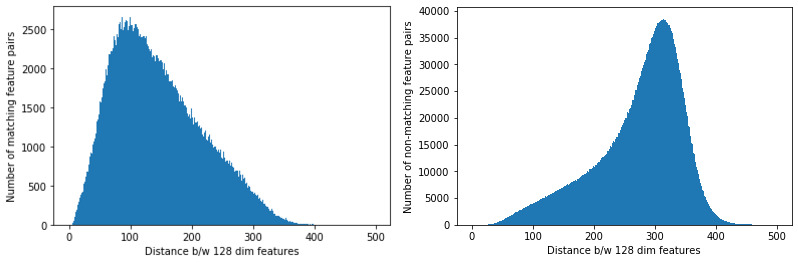
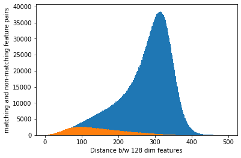
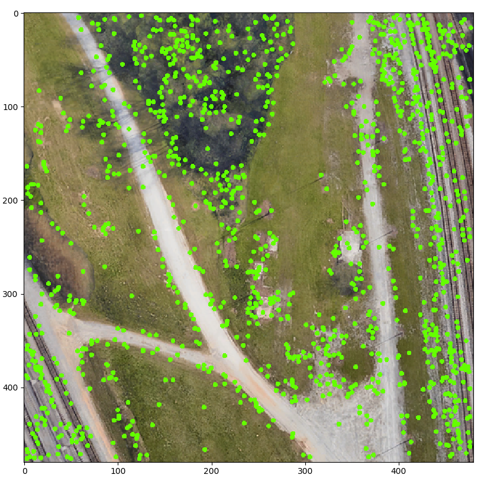
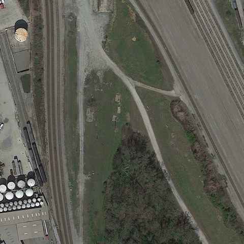
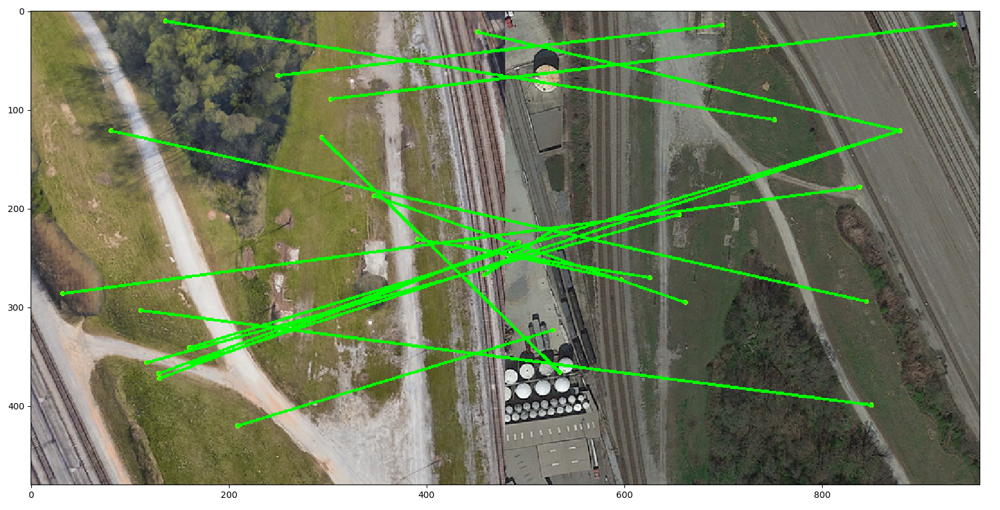
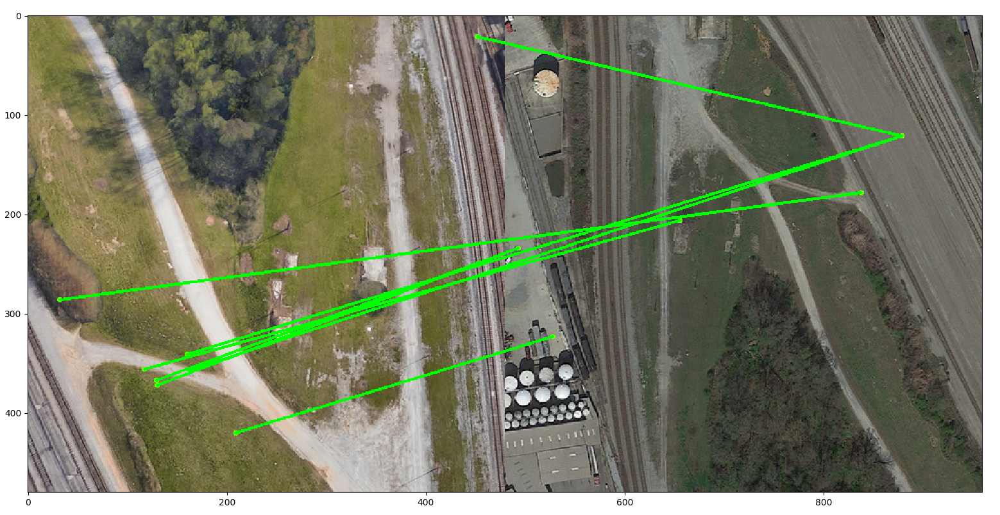

# Scene Localization through SIFT


## Theory
SIFT features are invariant to uniform scaling, rotation and illumination. 
It is also partially invariant to affine transformation. Hence, it makes 
sense to have SIFT as the baseline for any image matching task.

For this task, all the SIFT features from the satellite images are
extracted and stored in a database. The features from the current UAV
image are also extracted. UAV image features are compared with the 
satellite image features in the database in order to find the satellite
images corresponding to the current UAV image. The features are compared 
by the euclidean distance between them and the nearest neighbour is called 
a match. The feature distance of second nearest neighbour is used
in order to perform Lowe's ratio test (for filtering out incorrect
matches) with a value of 0.75. The matches are again filtered and the ones
with euclidean distance less than 200 are kept, rest are discarded. 

Ratio test filtering is proposed in Lowe's original paper for scale 
invariant feature transform. Euclidean distance based filtering is
inspired from the results of experiments I made by matching SIFT 
features in the HPatches dataset. The distribution of the correct 
and incorrect feature matches is shown below:





### Results from Matching

Let us look at an example. The following two images are corresponding UAV and satellite images respectively.  

  


  

Results of image matching with ratio test only:  


Results of image matching with both ratio test and euclidean distance filtering: 
  
We find that results from both are not good enough. They are in fact so bad, that in our task SIFT cannot even be considered as a baseline.

### Conclusions
SIFT does not yield good results for matching UAV images with satellite
images. There are following main reasons for the same:
* __Different Distributions__ : Both satellite and UAV images come from
different distributions. They are taken at different times with a 
different camera, and hence both have very different shadows and
textures.
* __Heavy Texture on Trees and Bushes__ : Note that aerial images
capture a lot of greenery. These trees and bushes are heavily textured,
thus they yield very high number of features. These features have
a high probability of mismatch due to similar repeated textures in 
the bushes.
* __Repeated Texture of Roads__ : Note that a straight road does not
have distinct feature points. Hence, there can be mismatch between 
different features extracted from roads in UAV and satellite images.
* __Vehicles on Roads__ : It is observed that images from UAV and
satellite, having been taken at a different time, also have different 
number of vehicles in matching images. However, it is also observed that
SIFT features on vehicles are usually unmatched.  

Based on these results, we can say that most of image matching algorithms
which are based on finding keypoints will not be very effective in this
task of aerial image matching. We need to have the features based on:
1. Shapes and edges in the image, or
2. Deep features based on entire image

# Code
The above scripts will extract and save SIFT keypoints and descriptors 
from the training and testing images in the dataset. You can view the 
extracted features and match the images using ratio test and euclidean
distance filtering as mentioned above.

## Dependencies
* Python3
* OpenCV with SIFT support
* h5py matplotlib numpy scipy tqdm pickle os argparse

## Dataset
You can download the dataset from this [link](https://uofi.app.box.com/s/4jfvpmxwiob0hcg25z4lgd5qgnk0q8nb). 
Extract the images from the dataset and place them in train and test 
directories as shown.
```bash
├── test
│   ├── detroit
│   │   ├── detroit_sat
│   │   │   └── all_sat
│   │   ├── detroit_traj
│   │   │   └── trajectory
│   │   └── detroit_uav
│   │       └── uav
│   ├── orlando
│   │   ├── orlando_sat
│   │   │   └── all_sat
│   │   └── orlando_uav
│   │       └── uav
│   └── portland
│       ├── portland_sat
│       │   └── all_sat
│       └── portland_uav
│           └── uav
└── train
    ├── atlanta
    │   ├── atlanta_sat
    │   │   └── sat300
    │   └── atlanta_uav
    │       └── uav
    ├── austin
    │   ├── austin_sat
    │   │   └── sat300
    │   └── austin_uav
    │       └── uav
    ├── boston
    │   ├── boston_sat
    │   │   └── sat300
    │   └── boston_uav
    │       └── uav
    ├── champaign
    │   ├── champaign_sat
    │   │   └── sat300
    │   └── champaign_uav
    │       └── uav
    ├── chicago
    │   ├── chicago_sat
    │   │   └── sat300
    │   └── chicago_uav
    │       └── uav
    ├── miami
    │   ├── miami_sat
    │   │   └── sat300
    │   └── miami_uav
    │       └── uav
    ├── sanfrancisco
    │   ├── sanfrancisco_sat
    │   │   └── sat300
    │   └── sanfrancisco_uav
    │       └── uav
    ├── springfield
    │   ├── springfield_sat
    │   │   └── sat300
    │   └── springfield_uav
    │       └── uav
    └── stlouis
        ├── stlouis_sat
        │   └── sat300
        └── stlouis_uav
            └── uav
```
## How to Run?
1. Extract keypoints and descriptors in train images:
```bash
$ python extract_features_train.py
```
2. Extract keypoints and descriptors in test images
```bash
$ python extract_features_test.py
```
3. View the keypoints of a particular image. Use `city`, `camera` 
and `image number` of your choice
```bash
python view_kp.py atlanta uav 5
```
4. View the matches after performing ratio test
```bash
python view_matches_rt.py 
``` 
5. View the matches after performing RT and euclidean distance filtering
```bash
python view_matches_rt_eu.py
```

For points 4 and 5, please edit the code accordingly if you want to see 
the matches other than the ones shown.