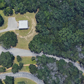
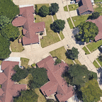
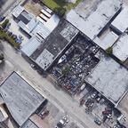

# UAV Geolocalization Using Satellite Imagery

|  &nbsp;&nbsp;  &nbsp;&nbsp; |
|:--:| 
| *3 examples of matching UAV and satellite pairs from dataset* |

* Download [*Aerial Cities* dataset](https://uofi.app.box.com/s/4jfvpmxwiob0hcg25z4lgd5qgnk0q8nb)
* Pre-trained Models: [DualResNet18+](https://github.com/abhinavtripathi95/geolocalization/raw/master/models/R00_allcities_export) [SiamResNet18+](https://github.com/abhinavtripathi95/geolocalization/raw/master/models/R00b_allcities_export)
* Training Notebooks: [DualResNet18+](R00_allcities_dualres.ipynb) [SiamResNet18+](R00b_allcities_siamres.ipynb)
