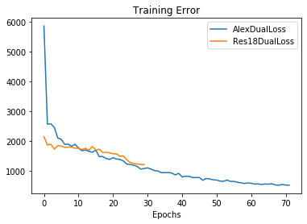

# Preliminary Results with Dual Resnet18 Network Architecture

## Training Strategy
* Untrained Resnet18 models initialized with `kaiming_normal_` strategy are used 
* The satellite images are normalized with mean and std of satellite images
* The UAV images are normalized with mean and std of UAV images
* Cyclical fitting policy with maximum learning rate of 0.1

## Requirements
* Cuda enabled GPU
* `torch==1.4.0`
* `torchvision==0.5.0`
* `fastai` library

## Training Loss Profiles
The training error is compared with AlexNet Dual Network architecture pre-initialized with
Imagenet weights, we trained earlier.

